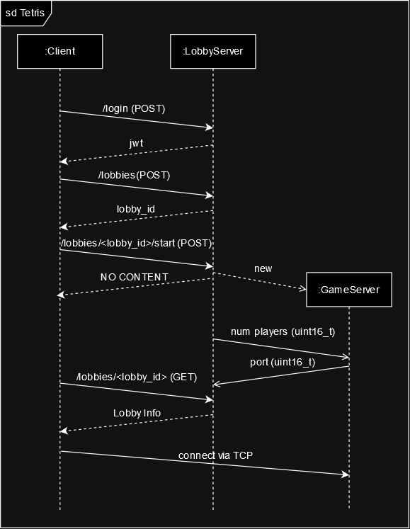

## Network Communication

All binary communication over TCP sockets is done in network byte order (big
endian).

## Initial Connection

Establishing the initial connection between the client and the gameserver is
done via the lobby server. The following sequence diagram illustrates a minimal
sequence leading to an established connection.

## Communication Between Client and Gameserver

### Message Types

Each message starts with a message header consisting of the message type (`uint8_t`) and the payload size (`uint16_t`).

| Value | Message Type     |
|-------|------------------|
| 0     | `Heartbeat`      |
| 1     | `GridState`      |
| 2     | `GameStart`      |
| 3     | `EventBroadcast` |

### Messages From Client to Server

- For every frame that is divisible by 15, the client sends a message to the
  server that contains all input events that have happened since the last
  message and up until the current frame.

  | Element          | Data Type  | Value                                                              |
      |------------------|------------|--------------------------------------------------------------------|
  | message type     | `uint8_t`  | 0 (`Heartbeat`)                                                    |
  | payload size     | `uint16_t` | 9 + 10 * \<number of events\>                                      |
  | frame            | `uint64_t` | the current frame (divisible by 15)                                |
  | number of events | `uint8_t`  | number of events contained in the message (at least 0, at most 15) |
  | event key        | `uint8_t`  | \<key\>                                                            |
  | event type       | `uint8_t`  | \<event_type\> (`OBPF_PRESSED` or `OBPF_RELEASED`)                 |
  | event frame      | `uint64_t` | \<frame\>                                                          |
  | more events...   |            |                                                                    |

- If a new piece is spawned in a given frame, the client sends the complete grid
  state at this point in time to the server.

  | Element       | Data Type          | Value                                                                                                                                                                                                                                                              |
      |---------------|--------------------|--------------------------------------------------------------------------------------------------------------------------------------------------------------------------------------------------------------------------------------------------------------------|
  | message type  | `uint8_t`          | 1 (`GridState`)                                                                                                                                                                                                                                                    |
  | payload size  | `uint16_t`         | 228                                                                                                                                                                                                                                                                |
  | frame         | `uint64_t`         | the current frame                                                                                                                                                                                                                                                  |
  | grid contents | `uint8_t[10 * 22]` | tetromino type of each individual tetrion in the grid (`OBPF_TETROMINO_TYPE_EMPTY`, `OBPF_TETROMINO_TYPE_I`, `OBPF_TETROMINO_TYPE_J`, `OBPF_TETROMINO_TYPE_L`, `OBPF_TETROMINO_TYPE_O`, `OBPF_TETROMINO_TYPE_S`, `OBPF_TETROMINO_TYPE_T`, `OBPF_TETROMINO_TYPE_Z`) | 

### Messages From Server to Clients

- After the expected number of clients have connected, the server sends all
  clients informations about the start of the game.

  | Element      | Data Type  | Value                            |
      |--------------|------------|----------------------------------|
  | message type | `uint8_t`  | 2 (`GameStart`)                  |
  | payload size | `uint16_t` | 17                               |
  | client id    | `uint8_t`  | \<id of each individual client\> |
  | start frame  | `uint64_t` | 180 (subject to change)          |
  | random seed  | `uint64_t` | \<random seed\>                  |

- As soon as all heartbeat messages for a given frame (divisible by 15) have reached the server, the server sends all input commands of all clients during the last period to all clients.

  | Element                    | Data Type  | Value                                                 |
    |----------------------------|------------|-------------------------------------------------------|
  | message type               | `uint8_t`  | 3 (`EventBroadcast`)                                  |
  | payload size               | `uint16_t` | 9 + \<client count\> * 2 + \<total event count\> * 10 |
  | frame                      | `uint64_t` | \<current frame\> (divisble by 15)                    |
  | num clients                | `uint8_t`  | \<client count\>                                      |
  | client id                  | `uint8_t`  | \<client id\>                                         |
  | num events for this client | `uint8_t`  | \<event count\> (at least 1, at most 15)              |
  | event key                  | `uint8_t`  | \<key\>                                               |
  | event type                 | `uint8_t`  | \<event_type\> (`OBPF_PRESSED` or `OBPF_RELEASED`)    |
  | event frame                | `uint64_t` | \<frame\>                                             |
  | more events...             |            |                                                       |
  | more clients...            |            |                                                       |
